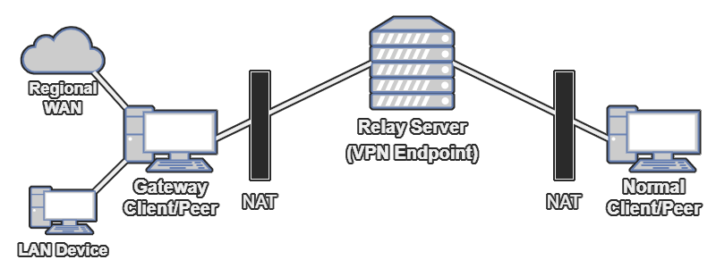
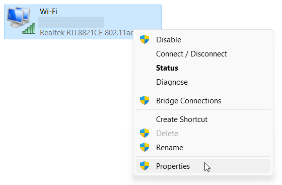
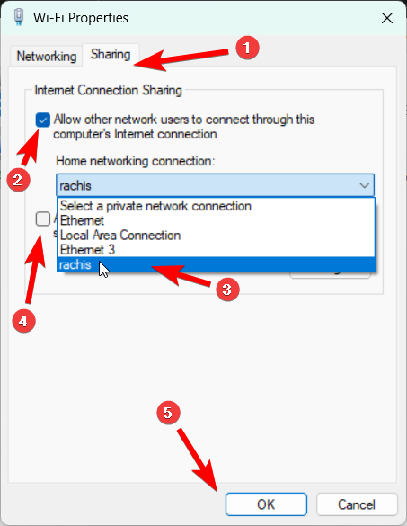

# 2-Hop WireGuard Installer

**This project is a bash script for setting up [WireGuard](https://www.wireguard.com/) VPN on a server with customized configuration to route the traffic through a device behind NAT.**



<!--
Diagram made using Draw.io. The source `.drawio` file is available within the assets directory.
GIMP was used to add black outline after exporting the diagram as a PNG image. In order to have the diagram readable on systems with the light theme used.
-->

Consider that you want to access a **LAN Device** within a _remote_ apartment, or use the internet with a public residential IP in a specific country (**_"Regional"_ WAN**).

Usually you would open a public port and run a VPN server on a device within that apartment, but the challenge rises when the internet connection is behind **NAT** ([Network Address Translation](https://en.wikipedia.org/wiki/Network_address_translation), that's usually the case for residential subscribers).
In such a case opening a port would depend on the ISP and require modifications to the router that _may not be possible_.

To walkthrough that, a server running on the cloud would be used to act as a **relay**, allowing authorized clients to connect to it anywhere and forward (**relay**) their traffic into the target device within the apartment (acting as a **"gateway"**).

Thus the traffic would take _virtually_ **2-hops** to reach the apartment (hence the name of the project).

### wg-2hop-script.sh

A script was created to install WireGuard on a server and configure the system for it to act as a relay.

- Allows the creation & deletion of additional clients after installation.
- The first client created during installation, or the client with the IP `192.168.197.1` **is the special "gateway" client**.
- Based on [wireguard-install](https://github.com/angristan/wireguard-install) but modified to not conflict with existing `wireguard-install` installation.
- Firewall & Routing tables are configured to isolate the clients from each other and protect the other services running on the relay server.
- The subnet is hardcoded to `192.168.197.0/24` to suite [Windows ICS](https://en.wikipedia.org/wiki/Internet_Connection_Sharing) and precalculate some filtering rules.
- A "soft uninstallation" option is added to remove only the configurations done by the script, leaving WireGuard installed on the system (incase it's used for other VPN tunnels).

#### Tunnel Firewall Configuration

When the tunnel is active, firewall rules are configured to:

- Isolate the relay server from the VPN peers traffic (prevent access to other services running on the same server).
- Isolate the traffic between the clients (clients are not allowed to communicate between each other).
- Disallow direct communication with the gateway client.
- Allow pinging the gateway client & the relay server.
- Allow the gateway client to ping any other client.

It should not interfere with other firewall configurations.

#### Tunnel Routing Configuration

When the tunnel is active, a custom routing table (`4224`) is used to prevent packets of the VPN from being routed to other interfaces.

Within the custom routing table, rules are added to forward the all traffic through the special "gateway" client. Except the traffic with the subnet mask of the VPN.

## Requirements

Supported distributions:

- AlmaLinux >= 8
- Arch Linux
- CentOS Stream >= 8
- Debian >= 10
- Fedora >= 32
- Oracle Linux
- Rocky Linux >= 8
- Ubuntu >= 18.04

## Usage

Download and execute the script. Answer the questions asked by the script and it will take care of the rest.

```bash
curl -O https://raw.githubusercontent.com/rachis-systems/wg-2hop-install/main/wg-2hop-install.sh
chmod +x wg-2hop-install.sh
./wg-2hop-install.sh
```

It will install WireGuard (kernel module and tools) on the server, configure it, create a systemd service and a client configuration file.

Run the script again to add or remove clients!

### "gateway" Client Configuration

It's the client with IP `192.168.137.1`, which is the first client created using the script by default. But that could be changed by selecting a different IP for the first client.

To setup a Windows client do the following:

1. Transfer the configuration file into the target device and import it and activate the VPN tunnel.
2. Search for `View network connections` in the start search bar and open that control panel.

3. Select the adapter with the network connection you want to share with the VPN, then open it's properties.

4. Share the adapter's connection with the VPN adapter.

    1. Switch to the **Sharing** tab.
    2. Check _"Allow other network users to connect through this computer's Internet connection"_.
    3. Select the VPN adapter (would have a name matching the configuration filename).
    4. Ensure that the _"Allow other network users to control or disable the shared Internet connection"_ box is **unchecked**.
    5. Confirm the changes by clicking _"OK"_.
5. Deactivate & Reactivate the VPN tunnel, the network sharing should work now.

## Script Footprint

_The modifications left on the system after execution._

- Installs `wireguard iptables resolvconf qrencode` on the system (if Debian/Ubuntu).
- Creates `/etc/sysctl.d/wg_2hop.conf` for enabling IPv4 packets forwarding on the server.
- The `/etc/wireguard` directory, for storing the server configuration.
    - `/etc/wireguard/params_2hop` for storing the answers of setup questions.
    - `/etc/wireguard/wg_2hop.conf` the configuration of the server tunnel.
- `~/*.conf` peers (clients) WireGuard configuration files.
    - **If the client name matches the name of a user on the system. That user's home directory would be used instead.**
- While the tunnel is active, modifications to the firewall are done, including the creation of `FORWARD_WG2HOP` chain.
    - The changes are undone when the tunnel is disconnected.
    - The changes are persisted using WireGuard configuration, disabling the tunnel or deleting it removes them.
    - The changes are not restored after reboot unless if the tunnel is set to start automatically (which is done by default using the script).
- While the tunnel is active, a custom routing table `4224` is created and used.

## Contributing

## Discuss changes

Please open an issue before submitting a PR if you want to discuss a change, especially if it's a big one.

### Code formatting

We use [shellcheck](https://github.com/koalaman/shellcheck) and [shfmt](https://github.com/mvdan/sh) to enforce bash styling guidelines and good practices. They are executed for each commit / PR with GitHub Actions, so you can check the configuration [here](https://github.com/angristan/wireguard-install/blob/master/.github/workflows/lint.yml).

## Credits & License

This script is a modified version of the [wireguard-install](https://github.com/angristan/wireguard-install) script by [angristan](https://github.com/angristan) which is available under the [MIT License](https://raw.githubusercontent.com/angristan/wireguard-install/master/LICENSE).

The script has been modified by [Rami Sabbagh](https://github.com/Rami-Sabbagh/) for [Rachis Systems](https://rachis.co).

### Modifications done on the script

- Changed the repository url in the script to `https://github.com/rachis-systems/wg-2hop-install`.
- Added a warning when the script is executed to note the user of the script being modified.
- Added an option for soft uninstallation, deletes the configuration only.
- Rename to `wg-2hop-install.sh`.
- **Dropped IPv6 support in the VPN (still supports public IPv6 of the server).**
- Changed the default interface name from `wg0` into `wg2hop`.
- Changed the default subnet.
    - IPv4 from `10.66.66.0/24` into `192.168.197.0/24`.
    - ~~IPv6 from `fd42:42:42::/64` into `fd42:42:40::/64`.~~ (IPv6 support has been removed later)
- Changed configuration filenames to avoid conflict with the original script.
    - Changed `/etc/wireguard/params` into `/etc/wireguard/params_2hop`.
- Changed the `PostUp`&`PostDown` options in the server config to configure the firewall & routing differently.
- The first client (with ip `192.168.197.12`) has customized configuration on the server side, client side and the firewall.
    - The subnet `192.168.197.0` is hardcoded.
    - Customized `AllowedIPs` and added `PersistentKeepalive`.
- Change how used IPs are detected.
